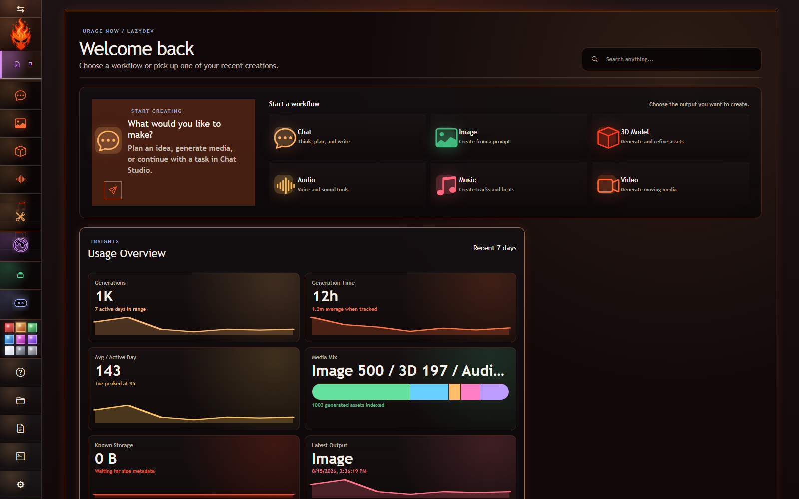
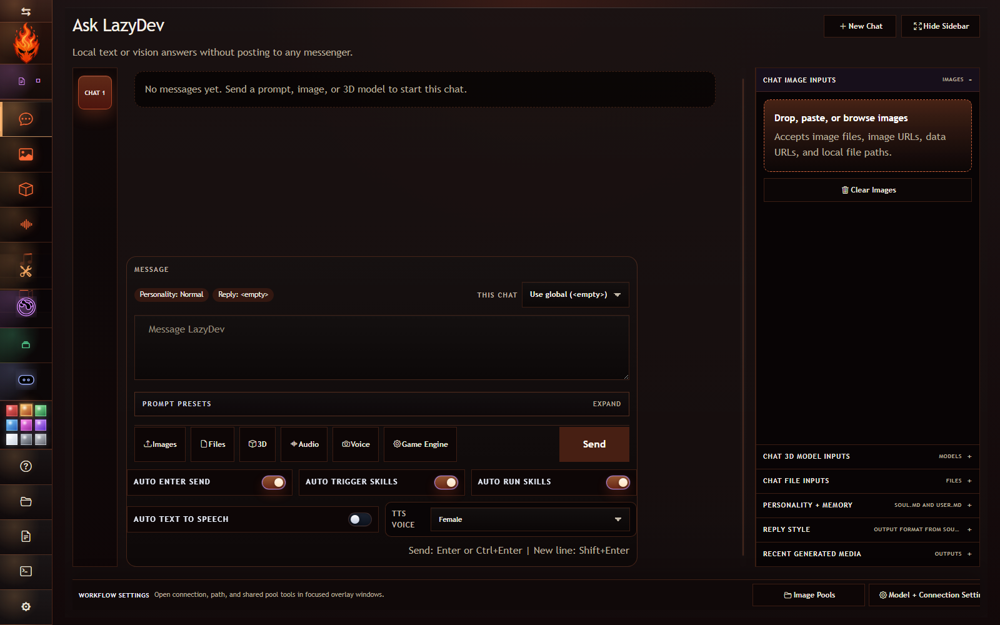
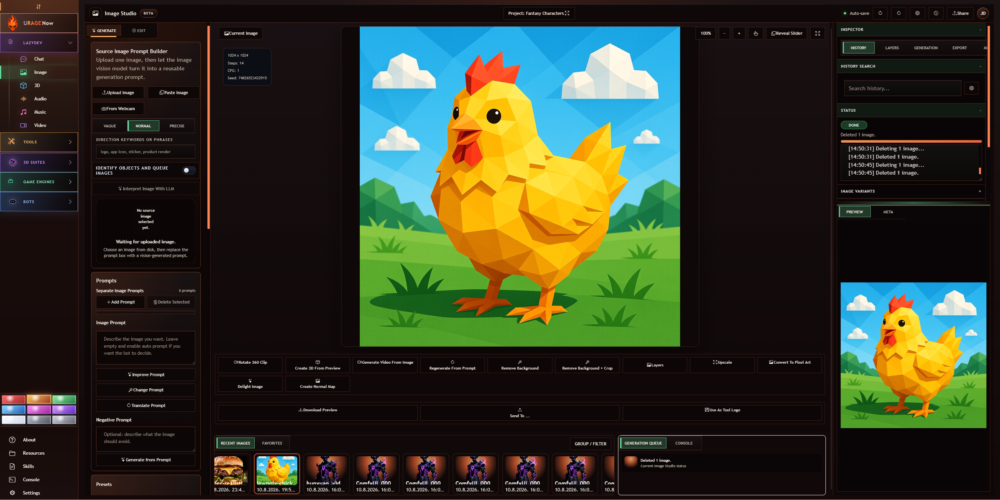
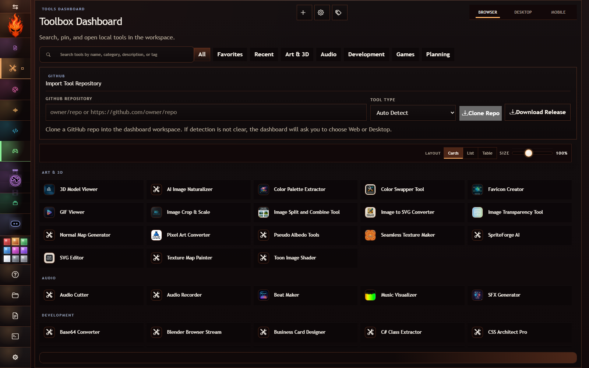
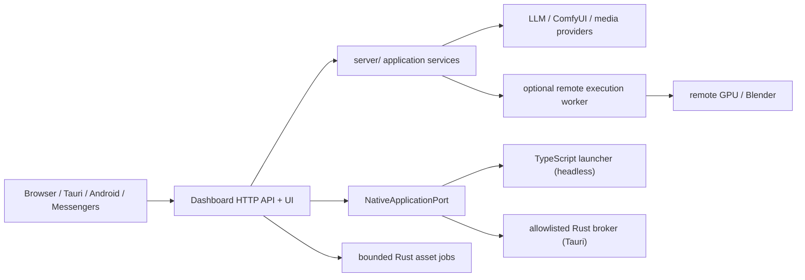

# URage Now Studio

URage Now Studio is a free, local-first creative workspace for Chat, Image, 3D,
Audio, Music, Video, tools, and optional messenger integrations. Run it in a
browser or desktop shell; workers, bots, and remote-machine support stay
optional.

## Current Screens

| LazyDev Home | Chat Studio |
| --- | --- |
|  |  |
| Image Studio | Tools Dashboard |
|  |  |

## Start Here

You need Windows 10/11, Node.js 22 or newer, and npm. Messenger credentials are
not required to use Studio.

```powershell
npm install
copy .env.public.example .env.public.local
npm run start:studio
```

Open `http://127.0.0.1:4782`. Most provider paths and credentials can then be
configured in **Studio Settings**. Keep secrets out of committed environment
files; use the Settings credential actions or the scripts described below.

Other supported ways to run it:

| Goal | Command |
| --- | --- |
| Dashboard/API only, no automatic bots | `npm run start:dashboard` |
| Dashboard development/watch mode | `npm run dev:dashboard` |
| Optional remote execution worker | `npm run worker:start` |
| Self-contained Tauri desktop installer | `npm run desktop:build` |
| Android companion release packages | `npm run build:android-release` |

## Components And Responsibilities

The names describe different responsibilities; they are not all separate
processes.

| Component | What it does | What it should not do |
| --- | --- | --- |
| **Studio** | The product experience: Chat, Image, 3D, Audio, Music, Video, Tools, Bots, and Settings. It is composed from dashboard UI features. | It is not a separate backend or worker process. |
| **Dashboard** | Serves the browser UI and authenticated HTTP API, coordinates workflows, exposes settings, and resolves generated assets. The neutral entrypoint is `runtime/dashboardRuntime.ts`. | It should not contain provider algorithms or duplicate worker implementations. |
| **Server** | The reusable TypeScript application/domain layer in `server/`: provider clients, generation services, job state, configuration, and runtime control. | `server/` is currently a library, not an independent HTTP listener. The historical `start:server` command starts a headless legacy composition host; see the note below. |
| **Remote execution worker** | Optional `workers/remote-worker` service for GPU/ComfyUI/Blender work deliberately assigned to another machine, another OS user, or an isolated local environment. It is used only when a request selects `executionTarget: "remote"`. | It is not the default local worker. Ordinary same-machine work uses the Dashboard/Server process or an on-demand Rust CLI, and this service does not serve the dashboard UI. |
| **Rust native layer** | The Tauri desktop shell plus bounded asset CLIs and the typed `native-application-broker` used by packaged desktop builds. | It should not become a second workflow server merely to move code to Rust. |
| **Messenger adapters** | Discord, Telegram, Matrix, and WhatsApp translate messenger events to the same application workflows. | They should not own generation business logic. |
| **Android companion** | Pairs with a dashboard over LAN or relays through Matrix, then exposes mobile Chat, Studio workflows, gallery, and transfers. | It is a client, not another source of workflow rules. |

The current request flow is:



There is one deliberate transitional seam: `runtime/dashboardRuntime.ts`
disables messenger autostart but still imports the legacy Discord composition
module for several adapters. That does **not** mean Discord owns the dashboard
conceptually. Removing that implementation dependency remains an incremental
refactor.

### Local Applications And The Rust Boundary

**Send To Bambu Studio** and local Blender opening now pass through a shared
`NativeApplicationPort`. The request contains an application ID, vetted
executable, argument list, working directory, and launch policy; browser input
cannot submit a shell command.

There are two adapters:

- browser/headless installations use the TypeScript process adapter;
- packaged Tauri installations inject the Rust `native-application-broker`.

The Rust broker accepts typed flags for only `bambu-studio` and `blender`,
validates executable names and asset/script arguments, launches without a
command shell, and returns a typed JSON result. It deliberately does not accept
arbitrary commands or environment maps. Remote Blender/GPU work remains the
remote worker's responsibility. See
[`memory-bank/runtime-component-boundaries.md`](memory-bank/runtime-component-boundaries.md)
for the dependency rules and the remaining Discord-composition migration.

## Highlights

- LazyDev workflows for chat, image, 3D model, audio, music, and video
- Messenger switching: Discord, Telegram, Matrix, and WhatsApp, including Discord DM conversations, Matrix room discovery, and persisted WhatsApp recipient shortcuts
- Dashboard themes loaded from bot-owned JSON files
- Windows launcher scripts with password-gated `runas` support
- Optional workers for isolated remote and native generation tasks

## When You Need An Execution Worker

The dashboard and messenger runtimes coordinate workflows, manage state, and
also execute the default **local** workflow path. Do not start an extra worker
just because Blender or ComfyUI is installed beside the dashboard.

Start the separate execution worker only when the workflow is explicitly set to
`executionTarget: "remote"`, including the deliberate case where that worker
runs on the same PC under a different user or with a separate GPU/Blender
environment.

- The **remote execution worker** (`workers/remote-worker`) is the execution boundary for tasks that must run on another machine, another Windows user, or a GPU/Blender installation that should stay separate from the dashboard. It currently serves remote 3D and Blender actions such as AutoRig, model previews, and opening models in Blender.
- The **Rust worker CLIs** (`workers/rust`) are invoked on demand for bounded jobs such as inspecting, validating, indexing, and probing generated assets. They are not a separately started service in the normal dashboard path.

You do **not** need to start the remote execution worker for normal same-machine use. Start
`run-worker.cmd` only when a workflow is configured with
`executionTarget: "remote"` or when you intentionally want its work isolated
from the dashboard user/process.

## Multi-Machine LAN Deployment

The dashboard, Discord runtime, remote worker, and other messenger runtimes can run on different machines. Those service runtimes communicate over configured HTTP URLs; they do not discover each other automatically. The optional Android companion is the exception: it uses a dedicated UDP LAN discovery probe and paired-device API.

The target security and remote-control architecture is documented in [`memory-bank/distributed-runtime-and-secrets.md`](memory-bank/distributed-runtime-and-secrets.md). Controlling a bot on another machine requires a restricted runtime agent on that machine; the dashboard cannot launch a remote process by configuration alone.

The prioritized hardening, cleanup, UX, and delivery work is tracked in [`memory-bank/production-readiness-roadmap.md`](memory-bank/production-readiness-roadmap.md).

- **Dashboard host:** set `DASHBOARD_BIND_HOST=0.0.0.0`, `DASHBOARD_PUBLIC_BASE_URL=http://<dashboard-ip>:4782`, `DASHBOARD_EXPOSE_API=true`, and a long `DASHBOARD_ACCESS_TOKEN`. Open `http://<dashboard-ip>:4782/?accessToken=<token>` once from each browser; the URL immediately redirects without the token and saves a short-lived HTTP-only session cookie. Optionally set `DASHBOARD_ALLOWED_CLIENTS` to comma-separated client IPs, IPv6 addresses, or IPv4 CIDR ranges. For reverse-proxied HTTPS companion access, use the canonical `https://` public URL and optionally set `COMPANION_TLS_CERTIFICATE_SHA256` to the leaf-certificate digest advertised for additional Android pinning.
- **Settings helper:** Dashboard `Settings -> Network` detects usable LAN addresses, shows readiness checks, recommends a URL and CIDR allowlist, persists the safe settings to `.env.main.local`, stores generated tokens in the OS credential store, and applies the listener/discovery changes live. It also provides scoped Windows Private-network firewall commands for manual review.
- **Remote browser login:** open the dashboard LAN URL normally. The dashboard presents a token login page and stores an eight-hour HTTP-only browser session. Copy the existing token explicitly from the dashboard PC with `Settings -> Network -> Copy Token`; tokens are never rendered automatically. The connection page also links to the allowlisted dashboard's signed Android APK page and to GitHub Releases as a fallback, without requiring a dashboard session.
- **Worker host:** set `REMOTE_WORKER_BIND_HOST=0.0.0.0` and a `REMOTE_WORKER_SHARED_SECRET`. On the dashboard host, set `REMOTE_WORKER_BASE_URL=http://<worker-ip>:5581` and the same secret, then choose the remote execution target.
- **Bot host:** run Discord with `scripts\bots\discord\run-main.cmd start-headless`, or run Telegram/Matrix/WhatsApp with their own environment files. Set `DASHBOARD_BASE_URL` (or `NODE_BOT_DASHBOARD_URL`) to the dashboard public URL and set the same `DASHBOARD_ACCESS_TOKEN` for bots that call dashboard APIs.
- **Messenger admin host:** point `TELEGRAM_ADMIN_BASE_URL`, `MATRIX_ADMIN_BASE_URL`, or `WHATSAPP_ADMIN_BASE_URL` at the bot machine. Bind those admin listeners only to the LAN when needed and use the same `MESSENGER_ADMIN_SHARED_SECRET` on the dashboard and bot hosts; also restrict the port with a firewall.
- **Android companion:** follow [`apps/android-companion/README.md`](apps/android-companion/README.md) or the standalone [URage Now Android Companion repository](https://github.com/sysoutch/urage-now-android-companion). It discovers HTTP/HTTPS dashboards on UDP `47820`, supports one-scan short-lived QR pairing and optional certificate pinning, stores its device token behind Android Keystore encryption, pages through stable media cursors, renders cached 320×240 thumbnails, and transfers media through revocable resumable upload/download jobs. Settings supports global and per-device policies, JSON backup/restore, and an access audit.
- **Companion access policy:** `Settings -> Remote Access` controls browse, download, upload, metadata-update, and delete capabilities globally; `Settings -> Devices` applies per-device overrides or revokes a phone. Android requests bounded gallery pages and destructive operations are disabled by default.
- **Android to Bambu Studio:** From Gallery or a completed 3D Studio result, Android can request that the paired dashboard host open a generated model in its configured Bambu Studio. This is a host-side, audited capability (`Open 3D models in Bambu Studio`), disabled by default; it requires the direct LAN/HTTPS dashboard route and does not launch desktop software on the phone or through Matrix relay.
- **Android to Bambu Studio:** From Gallery or a completed 3D Studio result, Android can request that the paired dashboard host open a generated model in its configured Bambu Studio. This is a host-side, audited capability (`Open 3D models in Bambu Studio`), disabled by default; it requires the direct LAN/HTTPS dashboard route and does not launch desktop software on the phone or through Matrix relay.

The dashboard can start or stop the embedded Discord runtime only when Discord runs in that same dashboard process. A bot on another machine is intentionally independent; start it with that machine's launcher or service manager so the dashboard never attempts to launch a remote Windows process.

## Screenshots

Studio | | | |
--- | --- | --- | ---
AI | Chat Studio, Image Studio, 3D, Audio, Music, and Video workflows | See the current screenshots above
Tools | Local web, desktop, and mobile tools with repository import | See the current screenshots above
Bots | Optional Discord, Telegram, Matrix, and WhatsApp integrations | Configure only the runtimes you use

## Repository Layout

```text
.
|- bots/
|  |- discord-bot/      # current host entrypoint plus Discord-specific adapter
|  |- telegram-bot/     # Telegram runtime
|  `- matrix-bot/       # Matrix runtime
|- workers/
|  |- remote-worker/    # remote generation worker entry + worker env templates
|  `- rust/            # native worker workspace for bounded heavy jobs
|- dashboard/
|  `- src/              # dashboard UI and HTTP adapter
|- apps/
|  `- android-companion/ # LAN discovery, pairing, and media transfer app
|- server/              # provider services, runtime state, and messenger process control
|- shared/              # shared contracts plus SOUL.md and USER.md chat configuration
|- blender-scripts/     # Blender automation scripts
|- data/                # runtime data
`- memory-bank/         # project context docs
```

The TypeScript workspaces use scoped imports (`@urage/shared`, `@urage/server`, and `@urage/dashboard`) instead of reaching into sibling `src` directories.

## Developer Prerequisites

- Windows 10/11 (scripts are Windows-first)
- Node.js 22+ and npm
- Optional: a Discord, Telegram, Matrix, or WhatsApp credential only for the
  messenger runtime you choose to enable

## Runtime Modes And Optional Messenger Setup

### Start the dashboard API and UI together

The dashboard API and browser UI are one HTTP runtime, so the normal combined launcher uses one process:

```powershell
npm run start:studio
```

Use `npm run dev:studio` for watch mode. On Windows, the equivalent direct launcher is `scripts\run-studio.cmd`.

### Start the runtime server and dashboard separately

Use two terminals when you want an independently restartable headless runtime and dashboard:

```powershell
# Terminal 1: Discord/runtime host, with the dashboard disabled
npm run start:server

# Terminal 2: dashboard HTTP/API host, with messenger autostart disabled
npm run start:dashboard
```

Use `npm run dev:server` and `npm run dev:dashboard` for watch mode. The `server/` workspace is a shared service library rather than a standalone HTTP executable; `start:server` therefore starts the existing headless runtime host instead of creating a second dashboard API. A fully remote dashboard-to-runtime control plane remains a separate architectural step.

Normal launchers no longer run the full dashboard build on every start. They only rebuild `generated.css` when SCSS inputs or the dependency lockfile are newer. Explicit `npm run build:dashboard` and Tauri production builds still perform the complete CSS and TypeScript build. Remote-worker launch never builds dashboard assets.

### Build the self-contained desktop installer

```powershell
npm run desktop:build
```

The Tauri build embeds a target-specific Node sidecar and the dashboard runtime resources, so the installed app does not require Node, npm, or a repository checkout. Its custom titlebar supplies minimize, maximize/restore, and hide-to-tray controls; the tray can open the dashboard, restart the owned runtime, open its log, or quit. See [`src-tauri/README.md`](src-tauri/README.md) for packaging details.

### Add Discord (optional)

1. Fill the Discord application identifiers in `.env.public.local`:

- `DISCORD_CLIENT_ID`
- `DISCORD_GUILD_ID`

2. Store the token securely for the signed-in Windows user:

```powershell
.\scripts\bots\discord\store-discord-token.cmd
```

3. Register slash commands:

```powershell
.\scripts\bots\discord\run-main.cmd register
```

4. Start the combined Discord + dashboard runtime:

```powershell
.\scripts\bots\discord\run-main.cmd start
```

Dashboard default URL: `http://127.0.0.1:4782`

## Dashboard and Worker Scripts

From repo root:

```powershell
npm run build:all
.\scripts\bots\discord\store-discord-token.cmd
.\scripts\run-dashboard.cmd start
.\scripts\run-worker.cmd start
```

`run-dashboard.cmd` is sufficient for local dashboard use. `run-worker.cmd` is optional and is only required for remote execution mode.

Run Discord without starting or building the dashboard with `scripts\bots\discord\run-bot.cmd`. The older `run-main.cmd` remains the combined Discord-and-dashboard launcher.

Store the Discord token once as the same signed-in Windows user that runs the dashboard. `run-dashboard.cmd` always uses that user so `%AppData%`, Unity Hub projects, file dialogs, and other profile data stay consistent.

For same-machine setups, the clean default is to run the dashboard and worker under the same standard desktop user instead of mixing dashboard/worker identities. That keeps Unity Hub catalogs, Blender user addons, file pickers, and other profile-scoped resources predictable.

If you intentionally run the dashboard under a different Windows account, set `UNITY_HUB_PROJECTS_PATH` to that desktop user's `projects-v1.json` file so Game Engines -> Projects can still read the Unity Hub catalog explicitly.

Runtime control (dashboard must be running):

```powershell
.\scripts\bots\runtime-control.cmd discord start
.\scripts\bots\runtime-control.cmd telegram start
.\scripts\bots\runtime-control.cmd matrix start
.\scripts\bots\runtime-control.cmd whatsapp start
```

The dashboard runtime overlay can now start messenger runtimes from three credential sources:
- `Default Environment`: use the current dashboard process environment, including the current Windows user's stored Discord token.
- `Safe Env File`: read credentials from a shared `.env`-style file path that you save in the dashboard settings.
- `Manual Entry`: paste credentials only for the current start or restart request. Manual secrets are not stored in dashboard settings.

The runtime overlay shows the currently selected credential source and only reveals the manual fields for the active messenger when `Manual Entry` is selected, so you can verify which launch mode will be used before pressing `Start`.

Example safe env file:

```dotenv
DISCORD_TOKEN_RUNTIME=your-discord-token
TELEGRAM_BOT_TOKEN=your-telegram-token
MATRIX_HOMESERVER_URL=https://matrix.example.com
MATRIX_ACCESS_TOKEN=your-matrix-access-token
MATRIX_BOT_USER_ID=@bot:example.com
WHATSAPP_ACCESS_TOKEN=your-whatsapp-access-token
WHATSAPP_PHONE_NUMBER_ID=1234567890
WHATSAPP_API_VERSION=v22.0
```

For same-machine production setups, keep the dashboard and worker on the same standard user account, and use the safe env file only when you intentionally want bot credentials managed outside that dashboard user profile.

## FFmpeg Setup

FFmpeg is used by the dashboard media converter tools.

- Quickest path: open Dashboard `Studio Settings -> Setup And Paths`, choose `Review FFmpeg`, review its purpose and default/custom install folder, then confirm the installation. Save or confirm the detected executable path afterward.
- Script path: run `scripts/_install/install-ffmpeg.ps1` from the repo root.
- Manual path override: save an explicit `ffmpeg.exe` path in the Studio Settings window, or set `FFMPEG_EXECUTABLE_PATH`.

If the FFmpeg path field is empty, the dashboard auto-detects `ffmpeg` from PATH, common Windows install folders, and the winget package location.

## 3D Print Application Setup

3D Studio's `Send To ... -> 3D Print` tab can open the selected model in BambuLab Studio. The launcher detects common installations on Windows, macOS, and Linux and passes the model as a single positional file argument, matching Bambu Studio's [official command-line usage](https://github.com/bambulab/BambuStudio/wiki/Command-Line-Usage). It starts the application directly without a command shell, inherits the URage NOW process's OS user, uses the detected application's directory as its working directory, and detaches its process and standard streams from the dashboard.

Set `BAMBU_STUDIO_EXECUTABLE_PATH` before starting URage NOW when Bambu Studio is installed elsewhere:

```dotenv
# Windows
BAMBU_STUDIO_EXECUTABLE_PATH=C:\Program Files\Bambu Studio\bambu-studio.exe

# macOS
BAMBU_STUDIO_EXECUTABLE_PATH=/Applications/BambuStudio.app

# Linux AppImage
BAMBU_STUDIO_EXECUTABLE_PATH=/opt/Bambu_Studio.AppImage

# Linux Flatpak
BAMBU_STUDIO_EXECUTABLE_PATH=/usr/bin/flatpak
```

The browser sends only the known application ID and selected model identity. Executable resolution stays server-side; launch requests cannot supply arbitrary executable paths.

## Studio Notes

- `blender-scripts/rig/autorigger/autorig.py` is Studio-parameterized: call Blender with `-- --llm-provider=ollama|lmstudio|none --llm-model=<model> --rig-profile=auto|basic_human|human|bird|cat|horse|shark|wolf|basic_quadruped`. Auto mode asks the configured vision model to choose humanoid vs animal and now defaults humanoids to Rigify `basic_human` instead of the extended human face/teeth metarig.
- AutoRig supports a verification pass with `--mode=preview --preview_dir=<dir> --result_json_path=<json>`, returning bone-guide preview renders plus editable landmark coordinates. The final rig pass accepts verified coordinates through `--landmarks_path=<json>`.
- 3D Model Studio includes an AutoRig quick action for the selected generated model; it opens a Mixamo-style visual marker placement screen with draggable chin/wrist/elbow/knee/groin rings before exporting the rigged model back into the same model record. The preview now uses Blender's front-camera projection metadata for ring placement, brighter render lighting, and finalization prints a binding status for the generated Rigify armature.
- 3D Model Studio groups outbound actions under `Send To ...` tabs for dashboard tools, game engines, desktop 3D suites, and 3D print applications. BambuLab Studio is the first print destination. Its source-image card also has an explicit `Paste` action that reads clipboard images into the same uploaded-source queue as Browse and Ctrl+V.
- Audio Studio and Music Studio now use the same collapsible right-sidebar layout as the other Studio workflows, and workflow tab styling is shared through `studio-workflow-tabs`.
- The rail `Resources` button opens central management for shared text sources and image pools. Text sources can be saved, appended, replaced, or generated with the LLM, and the same files are available to Studio workflows and Discord automation.
- Image Studio image-pool creation now opens the shared Resources pool editor, so new pools can be created from Image Studio without jumping into 3D Model Studio.
- Resource text-source rows show a capped preview of the current file contents, and image-pool thumbnails open a floating full-preview window when clicked.
- Image Studio quick actions such as remove background and delight can run from generated history images or uploaded edit sources, including GIF inputs.
- Image Studio's Separate Layers action shows workflow preflight status while its dialog is open, then checks its workflow shape, ComfyUI reachability, required nodes, and explicit selectable model files again before submitting work. Its configured Qwen Layers workflow uses ComfyUI API format; retain a separate editor-graph copy when you need to make visual workflow edits.
- Separate Layers exposes the Qwen workflow's `layers` integer, defaulting to two and applying it to the `EmptyQwenImageLayeredLatentImage` node of the configured API workflow.
- Image Studio multi-selection previews arrange selected images in an adaptive two-dimensional grid, reduce card size as the selection grows, and scroll only after the preview area is full.
- In the Three.js 3D viewport, click the canvas then press `F` to focus the loaded model or `.` to restore the default camera framing.
- The dashboard serves its pinned Three.js runtime and addon modules locally from `/vendor/three/`; the 3D viewport does not require unpkg or another runtime CDN.
- In Image Studio edit mode, the active uploaded source now becomes the main preview target so quick actions and edits follow the same image you are looking at.
- Image Studio prompt tools now include a `Translate Prompt` overlay with built-in language choices, an optional `Translate From` source-language selector, and a custom-language field for translating the selected prompt text in place.
- 3D Model Studio now keeps the selected model's stored source image available in the right sidebar as its own `Source Image` section, and the bottom `Model Details` pane stays reserved for human-readable model metadata.
- The Pixel Art tool now defaults `Auto pixel size` to enabled, and Studio quick-convert waits for the tool bridge to be fully ready before sending conversion jobs.
- In the Tools workspace, active tools with file inputs can now receive drag-and-drop files and pasted files directly from the workspace shell.
- Tools Dashboard can now clone GitHub tool repositories from either `owner/repo` or full GitHub URLs, extract setup/build notes from `README.md`, ask you to choose `Web` or `Desktop` when the repo type is not clear, and download the latest GitHub release asset with an asset picker when a release contains multiple files.
- Tools Dashboard also provides audited Add Tool and Edit Tool flows. LazyDev-assisted creation now performs a constrained planning pass followed by a real HTML/CSS/JavaScript implementation pass while the server retains the README, manifest, and integration contracts. Edit Tool stages manual or LazyDev-assisted changes, presents a visual diff, rejects stale stages, commits transactionally with automatic failure rollback, and retains a user-triggered backup rollback.
- Tool categories are defined by presets in `tools/categories/*.json`; the `game` directory is presented as **Games** without a breaking folder migration. The Categories & Tags overlay can add or override categories and assign, clear, rename, or globally remove persisted tags. Catalog search includes those tags.
- Add Tool shows the complete generated HTML/CSS/JavaScript and a baseline diff before creation. Category management can transactionally move a tool directory while updating its manifest and tag identity, hide preset categories with assigned-tool confirmation, and delete only unused custom categories. Tags support colors, autocomplete, filter chips, and set/add/remove bulk operations.
- Android Companion releases use `apps/android-companion/version.properties` plus a persistent ignored signing key. `npm run build:android-release` publishes a versioned signed APK and SHA-256 manifest for the dashboard download page at `/android-companion`.
- Add Tool shows the complete generated HTML/CSS/JavaScript and a baseline diff before creation. Category management can transactionally move a tool directory while updating its manifest and tag identity, hide preset categories with assigned-tool confirmation, and delete only unused custom categories. Tags support colors, autocomplete, filter chips, and set/add/remove bulk operations.
- Android Companion releases use `apps/android-companion/version.properties` plus a persistent ignored signing key. `npm run build:android-release` publishes a versioned signed APK and SHA-256 manifest for the dashboard download page at `/android-companion`.
- Game Engines -> Assets now gives each `Unity`, `Godot`, and `Unreal` panel its own manual GitHub import flow, so you can clone a repo or download the latest release directly into that engine's local asset workspace.
- Audio Studio TTS supports the standard Kokoro workflow plus the Qwen voice clone, custom voice, and design voice workflows in `comfyui-workflows/audio/tts`.
- Audio Studio STT and STS now support live microphone recording with a dynamic microphone picker, and recorded clips are fed through the same existing speech APIs as uploaded files.
- Chat Studio task cards now show queued follow-up skills from the skill router, and the Ask prompt presets are grouped into a compact foldout by category.
- Chat Studio now keeps obvious multi-step image requests such as `generate -> delight -> remove background -> pixel art` as a real skill chain, and the first image-generation step strips later follow-up instructions from the source prompt.
- Chat Studio streams skill planning details as separate assistant bubbles: resolved image prompts, 3D source image prompts, and model prompts appear before the long generation step finishes.
- Chat Studio skill routing and follow-up selection is model/metadata driven instead of English keyword heuristics, and prompt-plan bubbles accept structured planner objects without leaking `[object Object]`.
- Chat Studio includes the `generate-autorig` model follow-up skill for generated 3D model artifacts and keeps streamed model artifacts merged into the final chat bubble.
- Chat Studio personality, reply-style presets/custom formatting instructions, and durable user notes are stored in `shared/SOUL.md` and `shared/USER.md`, independent of the runtime working directory. Reply styles include an instruction-free option plus Markdown, plain text, JSON, XML, CSV, sanitized HTML, concise, step-by-step, and user-created formats. Individual chats can inherit the global reply style or keep a session-specific override without rewriting `SOUL.md`; composer badges show the effective saved personality and reply style.
- The Tools catalog can create a new local web tool manually or from a constrained LazyDev plan. Both modes render the same audited dashboard template; see [`tools/TOOL_TEMPLATE.md`](tools/TOOL_TEMPLATE.md). Chat Studio's `/` palette exposes live skills, while `/tools` drills into the current local tool catalog.
- Image Studio generation previews keep quick-action controls on a separate layer so loading placeholders do not overlap the buttons.
- 3D Model Studio's `Separate By Loose Parts` action now runs `blender-scripts/separate/separate_by_loose_parts.py` as a dedicated Blender edit workflow for the selected model, refreshes preview media, and supports the same local/remote execution route alias used by the UI.

## Telegram Runtime Setup

`bots/telegram-bot/bot.js` reads:
- `TELEGRAM_BOT_TOKEN` (required)
- `NODE_BOT_DASHBOARD_URL` or `DASHBOARD_BASE_URL` (optional, default dashboard URL)
- `TELEGRAM_ADMIN_HOST` / `TELEGRAM_ADMIN_PORT` (optional)

Typical run:

```powershell
cd bots/telegram-bot
npm install
npm run start
```

## Matrix Runtime Setup

Create env file from example:

```powershell
cd bots/matrix-bot
copy .env.example .env
```

Set:
- `MATRIX_HOMESERVER_URL`
- `MATRIX_ACCESS_TOKEN`
- optional `MATRIX_BOT_USER_ID`
- `DASHBOARD_BASE_URL` and `DASHBOARD_ACCESS_TOKEN` for dashboard workflows
- `MATRIX_ALLOWED_USER_IDS` and/or `MATRIX_ALLOWED_ROOM_IDS` to authorize `!chat`, `!image`, `!3d`, and Android relay requests

Then run:

```powershell
npm start
```

In an allowlisted room, use `!chat <prompt>`, `!image <prompt>`, or `!3d <prompt>`. Image and model results are uploaded to the Matrix content repository. Android Companion can use the same private room as an HTTPS internet relay without exposing the dashboard publicly.

## Theme Configuration

Dashboard theme variables are loaded from:
- `dashboard/assets/messengers/discord/theme.json`
- `dashboard/assets/messengers/telegram/theme.json`
- `dashboard/assets/messengers/matrix/theme.json`
- `dashboard/assets/messengers/whatsapp/theme.json`
- `dashboard/dashboard-theme-studio.json` (LazyDev theme)

## Developer Commands

```powershell
npm run runtime:dev
npm run build:dashboard
npm run check:discord
npm run check:dashboard
npm run check:worker
```

Worker dev:

```powershell
.\scripts\run-worker.cmd dev
```

Rust worker dev:

```powershell
cd workers/rust
cargo check
cargo run -p model-inspector -- --input C:\path\to\model.glb
```

## Notes

- Dashboard app source is intentionally separate from bot folders (`dashboard/src`).
- Dashboard launchers support role-based startup: `main`, `dashboard`, and `worker`.
- For script details, see:
  - `scripts/README.md`
